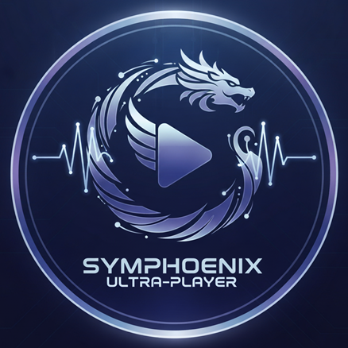
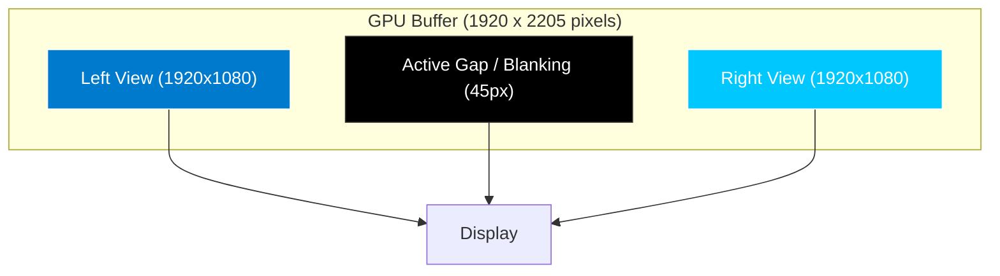
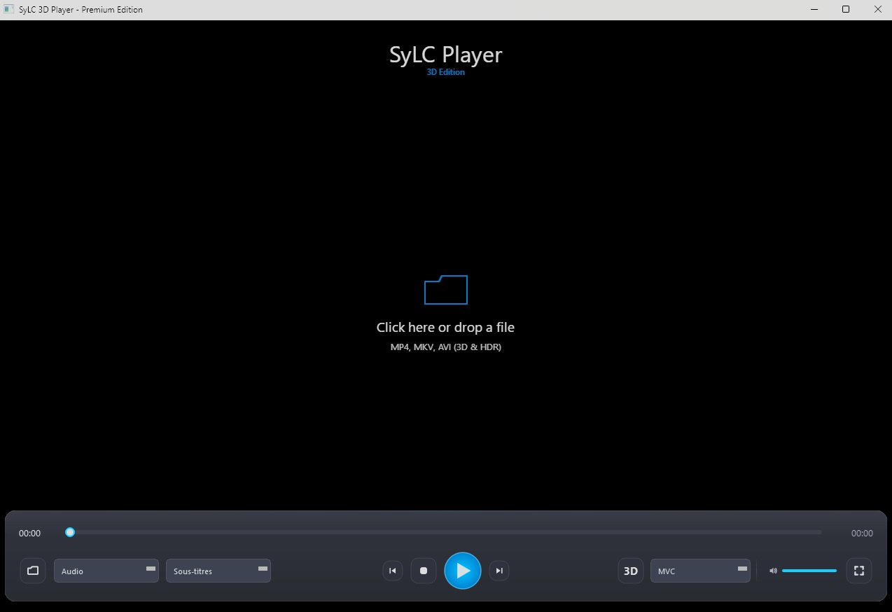

  
  <h1>SyLC 3D Ultra-Player</h1>
  <h3>The Ultimate PC 3D Experience: MVC, Frame Packing & High Fidelity.</h3>
  
  <a href="#download"><strong>Download Beta</strong></a> · <a href="#why-sylc"><strong>Why this Player?</strong></a> · <a href="#under-the-hood"><strong>Technology</strong></a>
  
   
  
  
  
  

---

## 🌌 Introduction

**SyLC 3D Ultra-Player** is not just another video player. It is the answer to a technological void that has frustrated 3D home cinema enthusiasts on PC for years.

While most modern players have abandoned true 3D in favor of compressed formats (SBS/TAB) or require complex, obsolete setups, SyLC was built with a single goal: **To restore the glory of Blu-ray 3D (MVC) on Windows.**

It natively reads **H.264 MVC** streams, decodes them in real-time, and sends them to your 3D projector or TV using the **Frame Packing** method, guaranteeing Full HD (1080p) quality for *each* eye.

## 🏆 Why SyLC is Unique

The problem with standard players (VLC, MPC-HC, etc.) is that they only see part of the video stream. A 3D MKV file contains two streams:
1.  **The Base View (AVC):** The left eye, readable by everyone.
2.  **The Dependent View (MVC):** The right eye, encoded as a "difference" relative to the left.

Most players simply ignore the second stream. **SyLC captures it, decodes it, and synchronizes it.**

### The 3 Supported Playback Modes

SyLC handles all formats, from the most basic to the most advanced:

| Mode | Description | Resolution per Eye | Verdict |
| :--- | :--- | :--- | :--- |
| **1. Side-by-Side (SBS)** | Images placed next to each other. | 960 x 1080 | *50% loss of horizontal definition.* |
| **2. Top-and-Bottom (TAB)** | Images stacked vertically. | 1920 x 540 | *50% loss of vertical definition.* |
| **3. FRAME PACKING** 🌟 | **The Holy Grail.** | **1920 x 1080** | **Pristine Blu-ray 3D Quality.** |

---

## ⚙️ Under the Hood: A Technical Feat

Developing SyLC required overcoming major obstacles where standard libraries failed.

### The MVC Decoding Challenge
To achieve Frame Packing, we couldn't rely on off-the-shelf decoders. We had to **rewrite and adapt a custom H.264 decoding core (based on `edge264`)**.

*   **Dual-Stream Extraction:** Our engine simultaneously separates and processes the base view and the dependent view (MVC).
*   **Atomic Synchronization:** Both views are reassembled with microsecond precision to avoid any "desync" effect or eye strain.
*   **Unified Buffer (Zero-Copy):** To ensure fluidity (24fps / 60fps), images flow between the C++ decoder and the rendering interface without unnecessary memory copying.

### The Frame Packing Architecture
This is where the magic happens. Frame Packing involves sending a "giant" image to the graphics card, containing both views separated by a silent band (active blanking).

SyLC generates this complex surface in real-time via custom OpenGL shaders, allowing your TV or projector to instantly recognize a native 3D signal.

---

## ✨ Key Features

*   **Auto-Detection:** Intelligent analysis of metadata (MKV, MP4, M2TS) to activate the correct 3D mode.
*   **"Glassmorphism" UI:** A modern interface that automatically fades away for total immersion.
*   **Smooth Timeline:** Stabilized "seek" system with thumbnail previews (even in 3D mode!).
*   **Windows Optimized:** Standalone, portable executable requiring no installation of shady external codecs.
*   **Bitstream Audio:** Support for multi-channel audio tracks.

## 🚀 Installation and Usage

1.  Download the latest **Release** (`.exe` file).
2.  Run `SyLC_Player.exe`.
3.  Drag and drop your 3D video file.

### 🌟 Frame Packing Special Instructions
To achieve the ultimate 3D quality (Frame Packing), follow these specific steps:

1.  **Configure Output:** Ensure your Projector/TV output resolution is set to **1920x2205** @ 24Hz (you may need to create a *Custom Resolution* in your NVIDIA/AMD control panel).
2.  **Move Window:** When the video starts, a "Tall" window will appear. **Drag this window onto your projector/secondary screen.**
3.  **Go Fullscreen:** Press **'F'** (or double-click). The window will cover the entire 1920x2205 area, triggering the hardware 3D mode on your device.
4.  **Put on your glasses!** 👓

*Note: For standard SBS or TAB modes, simply toggle fullscreen on any standard 1080p display.*

## 🛠️ Credits

Developed with passion by **Symphoenix**.
*   UI Engine: PySide6 (Qt)
*   Video Engine: Custom C++ implementation & MPV
*   Logo: Symphoenix Arts

---
*This software is the result of months of research and reverse engineering to bring true 3D back to our screens. Enjoy!*
