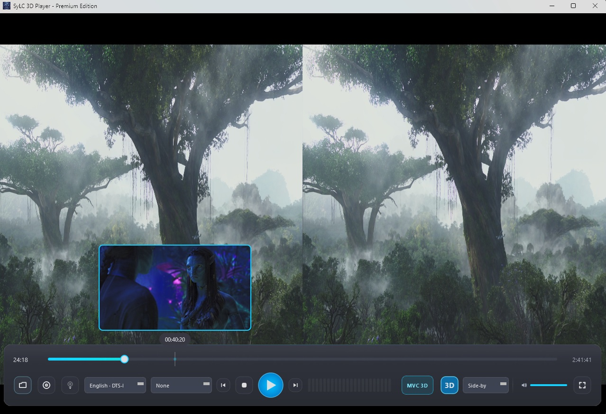

<div align="center">

# SyLC 3D Player

<p align="center"></p>
<p align="center"></p>

### A free, open-source player for the 3D formats the industry left behind.

*Stereoscopic 3D Blu-ray (MVC) **and** modern MV-HEVC playback, decoded from scratch, rendered in native HDR — given to the community, no strings attached.*


</div>

---

## What's new in v5.0.0

Version 4 taught the player to decode **MVC** — the H.264 stereo format on 3D Blu-rays — both eyes, from scratch. Version 5 opens the **HEVC** era and adds a way to *carry your 3D forward*:

- **🎞️ A native HEVC path — via libavcodec, driven directly.** H.264 was never the only stereoscopic H.26x format. SyLC now decodes **HEVC** through **`avcodec-62`** called straight over **ctypes** (no mpv round-trip): **Full-SBS (FSBS)**, **Frame-packed (FTAB)**, **half-SBS/TAB**, up to **4K 10-bit**. When the GPU can, decode runs on **D3D11VA** with a **bit-exact copy-back** (NV12 / P010, verified max-diff 0 against software). **HDR10 / PQ** is handled analytically end-to-end — **BT.2020** primaries into the **scRGB** 16-bit-float swapchain — never tone-mapped down.
- **🥽 MV-HEVC — the format of spatial video.** SyLC reads **MV-HEVC** streams (the two-layer HEVC used by Apple "spatial video" and MV-HEVC Blu-rays), pairing the two views **strictly by PTS**, and presents them through one **unified MultiView experience** (frame-pack / SBS / TAB) shared with the MVC path.
- **💿 BD3D backups without SSIF, in real 3D.** Some MakeMKV backups image a 3D disc **without the interleaved `.ssif`** — the base and dependent views land in **two separate `.m2ts` files**. Earlier versions could only fall back to 2D. v5 adds a **dual-file demuxer** that re-pairs the two streams and plays them as **true stereoscopic 3D**, following the `STN_table_SS` mapping in the playlist.
- **📤 Export to MV-HEVC QuickTime.** A new **Save / Export** menu (on the disc button) writes an Apple-canonical **`hvc1 + hvcC + lhvC`** `.mov` from **four source families — including MVC, a first**. When the source is already conformant it **remuxes bit-exact with no re-encode**; otherwise it re-encodes with **x265 4.1 built in-house with multiview enabled** (no reputable prebuilt ships it). A minimal **`vexu`** box is injected for correct stereo signalling, and audio is remuxed losslessly.
- **🎯 Reliability & polish.** A universal **VU-meter observer-cache** (levels read off mpv's event thread, never a blocking poll); **ratio-faithful preview thumbnails** decoded through avcodec; **UI stability** — a fixed-width format badge slot and a control bar that can no longer overflow its window; and a **pixel-perfect renderer** with an integer-snapped viewport (the last stray edge column is gone).

Everything from v4.5 — the in-house **MVC** decoder, the native **D3D11 HDR** renderer, in-process **timeline preview thumbnails**, and the **disc→ISO archiver** — is here and unchanged.

---

## Why this exists

In 2017 the industry quietly killed 3D. Blu-ray players stopped shipping it, TVs dropped it, and the software that could play **3D Blu-rays** — encoded in a format called **MVC** — was discontinued one app at a time. The discs didn't disappear. The collections didn't disappear. The *players* did.

And here's the cruel part: **MVC can't be played by the tools everyone already has.** When you rip a 3D Blu-ray to an MKV, you get an H.264 stream carrying **two interleaved camera views** — left and right eye, the second view encoded as differences against the first. FFmpeg — the engine inside VLC, MPC-HC, and nearly every "it plays everything" player — **decodes only the base view and silently throws the 3D away.** You get a flat 2D picture and no warning. The depth is *in the file*. Nothing on your machine will show it to you.

**SyLC 3D Player is the answer to that problem.** It is a complete, from-scratch stereoscopic pipeline — its own MVC decoder, its own demuxer, its own HDR renderer — built over months specifically so that your 3D library plays again, in full quality, on modern hardware. As of v5 that pipeline also speaks **HEVC / MV-HEVC**, so the *new* generation of stereoscopic content — spatial video included — plays in the same place. It is **free, open-source, and unencumbered**. No license, no activation, no trial, no telemetry.

As far as we know, it is **the only actively-developed, open-source player that truly decodes MVC** — both eyes — and renders it in real HDR.

---

## What makes it unique

- 🧬 **It doesn't lean on FFmpeg for the hard part.** The 3D is decoded by a custom in-house H.264/**MVC** decoder that reconstructs *both* views — the thing mainstream players can't do.
- 🎞️ **Every H.264 runs on the in-house decoder.** Not just MVC — plain 2D, **Full-SBS (FSBS)**, and H.264 in **MP4 / AVI / MOV / raw** all decode through edge264 and its pipeline.
- 🎥 **HEVC decoded directly through libavcodec.** FSBS / FTAB / SBS / TAB up to 4K 10-bit, with **D3D11VA** hardware decode and bit-exact copy-back — plus **MV-HEVC** two-layer streams paired by PTS.
- 🌈 **True HDR, not a tone-mapped fake.** Frames land in a 16-bit-float **scRGB** Direct3D 11 swapchain; a GPU shader does YUV→RGB and the stereo frame-packing in one pass. HDR10/PQ (BT.2020) is preserved end to end.
- 🥽 **Real 3D output.** Frame-packed stereo to a detached window for 3D TVs, projectors and HMDs — plus an embedded 2D preview.
- 📤 **Carry your 3D forward.** Export to **MV-HEVC QuickTime** (`hvc1+hvcC+lhvC`, `vexu`-signalled) — bit-exact remux when possible, otherwise re-encoded with an in-house multiview x265.
- 🎯 **Pixel-exact.** The decoder's luma output has been verified byte-for-byte against FFmpeg's base view. It's not "close enough" — it's correct.
- 🪶 **Self-contained.** One executable, or one portable folder. Nothing to install, no codec packs, no system pollution.
- 💿 **Archive your discs.** Image the 3D Blu-ray you're watching to a **byte-perfect `.iso`** from inside the player — one click, no admin, no external tool — so a failing optical drive can't take your collection with it.
- 🔍 **A timeline that shows you where you'll land.** Hover the seek bar and a large preview thumbnail follows your cursor — decoded **in-process by the same engine as playback**, live even during MVC playback and on mounted Blu-ray ISOs. Click, and you land **exactly** on the frame the preview promised.

---

## Under the hood

For the curious, here is what is actually happening between the file and your eyes — and why each step was hard enough to be interesting.

### 1. The decoder — `edge264`, taught to see in stereo
The heart of the H.264 path is **[edge264](https://github.com/tvlabs/edge264)**, a remarkable single-translation-unit H.264 decoder with hand-written SIMD kernels — **SSE2→AVX2** on x86, **NEON** on ARM. It is fast, lean, and BSD-licensed. But like everything else, it spoke only 2D.

This project extends it into a real **MVC (Annex H)** decoder: a second *dependent* view that predicts itself from the *base* view across the inter-view boundary, a per-view **decoded-picture-buffer** that has to honour `max_dec_frame_buffering` *separately* for each eye, SPS↔Subset-SPS fallback, PPS inheritance, frame-pairing, and graceful buffer-overflow handling so the two eyes never drift apart. Getting two interdependent H.264 bitstreams to march in lockstep, frame for frame, is most of the engineering.

### 2. The HEVC path — libavcodec, driven directly
HEVC does not go through mpv. SyLC binds **`avcodec-62`** over **ctypes** and drives the decode loop itself, so it can pull the exact frame layout it needs and detect the stereo packing (SEI / container tags: FSBS, FTAB, SBS, TAB) before the first picture. On capable GPUs it attaches a **D3D11VA** hardware device and copies the decoded surface back **bit-exact** (NV12 8-bit / P010 10-bit). **MV-HEVC** two-layer streams are read as a pair and matched **by PTS**, so left and right stay locked. PQ/HDR is computed analytically — BT.2020 → scRGB — with no SDR round-trip.

### 3. The demuxer — pulling two eyes out of one container (or two)
A dedicated **C++ demuxer** (pybind11, on top of **libmatroska/libebml**) opens the MKV, finds the MVC track, and de-interleaves the base and dependent NAL units into the exact order the decoder expects — feeding a zero-copy ring buffer so decode never waits on I/O. For **raw Blu-ray** it reads **SSIF** directly; and for **SSIF-less backups** it opens the **two separate `.m2ts` files** and re-pairs the views itself (dual-file mode).

### 4. The renderer — HDR all the way to the panel, in native C++ D3D11
Decoded YUV planes are uploaded straight to the GPU. A **Direct3D 11** shader converts colour and assembles the stereo frame inside an **RGBA16F (scRGB)** HDR surface — the format Windows uses for native HDR — so there is no SDR round-trip and no OpenGL→DXGI copy tax. As of **4.1.0 the renderer is a ground-up _native C++ D3D11 engine_** that takes decoded planes **straight into D3D11 textures** with no per-frame Python/Qt copy. For **Full-SBS** content each eye is **letterboxed into its frame-pack slot, never stretched**. In v5 the present viewport is **integer-snapped** and self-heals on resize, so there is no stray uncovered edge column even in fake-fullscreen or under DPI scaling.

### 5. The real-time problem — and the Python GIL
Audio rides on **libmpv**; video is slaved to mpv's clock so the two stay locked. Decoupling presentation from decoding (a dedicated presenter thread with back-pressure) and tuning the **CPython GIL** (`sys.setswitchinterval(0.0005)`) turned a hitchy 16 fps with dropped frames into a steady 24 fps with zero drops. As of **4.5.0 the MVC decoder itself is multithreaded** — **4 worker threads by default** for roughly **+80 % throughput** (80 → 146 fps measured), still bit-exact against the single-threaded reference. Audio levels are now read from mpv's **event thread into a cache** (no blocking poll on the GUI thread), which removed a class of teardown stalls.

---

## Export — carry your 3D forward

New in v5: a **Save / Export** menu on the disc button writes a **QuickTime `.mov`** carrying **MV-HEVC** (`hvc1 + hvcC + lhvC`, `colr nclx`, a minimal `vexu` stereo box). It accepts **four source families**, including **MVC — a first for an open tool**:

- **Fast (remux, bit-exact)** — when the source is already a conformant MV-HEVC stream, the elementary stream is copied through with **no re-encode**; the menu labels this "copy without re-encoding".
- **Quality (re-encode)** — otherwise the views are encoded with **x265 4.1 built from source with `-DENABLE_MULTIVIEW=ON`** (no reputable prebuilt Windows binary ships multiview). The elementary stream is muxed by **MP4Box (GPAC)** — the only tool tested to emit the Apple-canonical `lhvC` layout that SyLC itself reads back.

Audio is remuxed losslessly alongside. Export can run **while playback continues**, and cancelling leaves no partial file.

---

## Features

- **3D MVC playback** — H.264 Stereo High (profile 128), both views decoded in-house.
- **HEVC playback** — FSBS / FTAB / SBS / TAB up to **4K 10-bit**, decoded through **libavcodec** with **D3D11VA** hardware decode and bit-exact copy-back; HDR10/PQ preserved.
- **MV-HEVC playback** — two-layer HEVC (spatial video / MV-HEVC discs), views paired by PTS, shown through the unified **MultiView** output.
- **All H.264 through edge264** — MVC, plain 2D, and **Full-SBS (FSBS)** all decode in-house; **mpv is only a fallback** for codecs the in-house paths don't handle.
- **BD3D backups without SSIF** — base + dependent views split across **two `.m2ts` files** are re-paired and played as **true 3D** (dual-file demuxer).
- **Export to MV-HEVC QuickTime** — Save/Export menu, four source families (incl. MVC), **bit-exact remux** when possible, else in-house multiview x265; `vexu`-signalled `hvc1+hvcC+lhvC`.
- **Native C++ Direct3D 11 rendering** with **HDR (PQ)** preservation and high-quality scaling — the sole render path (the legacy Qt/RHI engine was removed in 4.1.0).
- **Frame-packed 3D output** (detached window) + embedded 2D view.
- **Broad container support** — **MKV / MP4 / AVI / MOV / FLV / WebM / raw `.h264`** decoded by edge264; **HEVC** in MKV/MP4/MOV through the libavcodec path.
- **Raw Blu-ray streams** — plays **SSIF** (3D) and **M2TS** (2D) directly, *no remux*, with frame-accurate seeking.
- **Open a whole Blu-ray** — point SyLC at a **disc/drive, a BDMV folder, or an `.iso`**; the feature film is auto-detected by **duration-based main-title detection** (3D preferred). ISO images are **auto-mounted without admin rights** and released on exit.
- **Archive a Blu-ray to ISO** — image the disc you're playing to a **byte-perfect `.iso`** from inside the player (no admin, no external tool); resilient to a flaky drive, with optional **SHA-256** verification.
- **Non-H.26x compatibility** — VC-1 / MPEG-2 … (incl. 2D Blu-rays) play through libmpv at the correct aspect.
- **PGS (Blu-ray) subtitles** — streamed in real time, **labelled by language**, and shown on **both the 3D and the 2D** views.
- **Timeline preview thumbnails** — hover the seek bar for an instant, **ratio-faithful** preview with a time pill, decoded **in-process** (edge264 for H.264, avcodec for HEVC). Live during MVC playback and on mounted Blu-ray ISOs. **Clicking lands exactly on the previewed frame.**
- **Live A/V sync trim** with `[` and `]` (persisted). True container-PTS timestamps with micro-pacing keep lip-sync honest.
- **Live VU meters** — audio levels read off mpv's event thread into a cache (never a blocking poll), stable across seeks and teardown.
- **Completely free** — every feature unlocked, forever.

### Keyboard shortcuts
| Key | Action |
|---|---|
| `Space` | Play / Pause |
| `Esc` | Exit fullscreen |
| `]` / `[` | Delay / advance the video for A/V sync (±50 ms) |

---

## Native x64 build — no emulation

| Flavor | Asset | Notes |
|---|---|---|
| **Single file** | `SyLC_3D_Player_v5.0.0_win-x64.exe` | One self-contained executable. First launch unpacks to a local cache; later launches are instant. |
| **Portable folder** | `SyLC_3D_Player_v5.0.0_win-x64.zip` | Unzip anywhere and run `SyLC_3D_Player.exe` — no extraction step, no installer. |

Both are built for the **x86-64-v3 (AVX2)** baseline — the decoder's SIMD hot loop runs
natively on any AVX2 CPU (Haswell 2013+ / Zen 1+): real silicon, no translation layer.
*(The ARM64/NEON port lives in the codebase, but **5.0.0 ships Windows x64 only**.)*

---

## System requirements

- **Windows 10/11 (x64)**.
- A **Direct3D 11**-capable GPU (an HDR display to enjoy HDR; a D3D11VA-capable GPU for HEVC hardware decode).
- A CPU with **AVX2** (standard since ~2013).
- Input: a **3D MKV** (MVC track), an **HEVC / MV-HEVC** file (FSBS/FTAB/SBS/TAB, spatial video), a **raw Blu-ray stream** (`.ssif` / `.m2ts`), a **BDMV disc/folder**, or a **Blu-ray `.iso`**. Rip with **MakeMKV**, or just point SyLC at the disc. (2D files of any codec play through libmpv.)

> **No remux required for Blu-rays.** Open the **disc/drive**, the **BDMV folder**, or the **`.iso` directly** — SyLC mounts the image (no admin), finds the 3D feature by duration, and streams it straight off. SSIF-less backups (two `.m2ts` files) still play in real 3D.

---

## Get started

1. Download the asset for your platform from **Releases**.
2. Run `SyLC_3D_Player_v5.0.0_win-x64.exe` (single file) — or unzip `SyLC_3D_Player_v5.0.0_win-x64.zip` and run `SyLC_3D_Player.exe`.
3. Open your 3D content — a **MKV**, an **HEVC / MV-HEVC** file, a raw **`.ssif` / `.m2ts`**, a **BDMV folder**, or a Blu-ray **`.iso`** (drag-and-drop, the **Open file** button, or the **disc** button). Send the frame-packed window to your 3D display and enjoy.

Nothing to install. Everything — decoders, demuxer, audio, codecs, Python runtime — is bundled in the release.

---

## Build from source

Everything needed lives in this repository: the Python application, the **decoder sources** (`edge264/`), the **demuxer sources** (`mvc_realtime_demuxer/`), the **native renderer** (`native_renderer/`), the support binaries, and the build scripts. Full details in the build scripts and `pyproject.toml`.

The short version (x64):

```bat
:: edge264 decoder (MSYS2 / UCRT64) — portable AVX2 build
gcc -shared -o edge264.dll -O3 -march=x86-64-v3 -flax-vector-conversions edge264/src/edge264.c -lpthread

:: one-file no-console executable (Nuitka + MSVC 2022)
build_exe_onefile.bat
```

Prerequisites: **Python 3.14**, `pip install -r requirements.txt` + `nuitka` + `pybind11`, **MSVC 2022**, and **MSYS2/GCC** for edge264.

> **Large libav / mpv DLLs are not committed.** `avcodec-62.dll`, `avfilter-11.dll` and `mpv-2.dll` exceed GitHub's 100 MB per-file limit and therefore ship with the **release binaries**, not this source tree. Provide them from a matching FFmpeg/mpv build (or the release) when running from source. A system **`ffmpeg`** on `PATH` also satisfies the export audio remux step.

### Bundled tools & their licenses

The `tools/` folder ships the encode/mux toolchain used by the MV-HEVC export, kept
in-tree so export works out of the box (batteries-included):

- **`tools/x265/`** — `x265.exe`, GNU **GPL v2+**. Built **from the official 4.1 source**
  with `-DENABLE_MULTIVIEW=ON` (no reputable prebuilt ships multiview). For full GPL
  compliance the tree includes the **verbatim `LICENSE`**, a **`provenance.txt`** (source
  URL + sha256, toolchain, exact configure command), and **`cmake4-compat.patch`** — the
  complete, non-functional CMake-4 configure patch applied before building.
- **`tools/gpac/`** — **MP4Box** (GPAC), **LGPL v2.1+**. The MV-HEVC muxer; the full
  runtime layout is shipped so it muxes standalone (`provenance.txt` documents source +
  sha256).
- **`ffmpeg` CLI** is a **runtime prerequisite on `PATH`** for the export audio remux
  (and is the source of the large libav DLLs above).

---

## Architecture at a glance

```
   MKV (MVC) / HEVC / MV-HEVC / SSIF / dual M2TS
      │
      ▼
 ┌──────────────┐   base + dependent NAL units (zero-copy ring buffer)
 │  C++ demuxer │   ── or ──  libavcodec (HEVC / MV-HEVC, ctypes)
 │ libmatroska  │ ───────────────────────────────────────────────►
 └──────────────┘
      │
      ▼
 ┌──────────────┐   two interdependent views, decoded in lockstep
 │ edge264 MVC  │   (AVX2 · NEON · GIL released)   │  HEVC via D3D11VA
 │  · avcodec   │ ───────────────────────────────────────────────►
 └──────────────┘
      │ YUV planes (8/10-bit)
      ▼
 ┌──────────────┐   YUV→RGB + stereo frame-packing in one GPU pass
 │ Native D3D11 │   RGBA16F (scRGB) HDR swapchain, integer-snapped viewport
 │  HDR shader  │ ──────────────►  3D display / projector / HMD
 └──────────────┘
                    audio ── libmpv ──► clock that video is slaved to
```

*As of 4.1.0 the **native C++ D3D11** renderer is the sole render path; decoded planes go straight into D3D11 textures with no per-frame Python/Qt copy. Full-SBS eyes are letterboxed into the frame-pack slot, not stretched.*

---

## License & credits

**Free & open-source.** The **edge264** decoder is **BSD**-licensed (see `edge264/LICENSE_BSD.txt`). SyLC also stands on the shoulders of great GPL/LGPL projects — please honour their licenses when redistributing. In particular the bundled **x265** (GPL v2+) is built and shipped as a **separate, unmodified-encoder process** invoked by the export feature, with full source provenance under `tools/x265/`.

- **[edge264](https://github.com/tvlabs/edge264)** — the fast H.264/AVC decoder this project extends to MVC
- **[FFmpeg / libavcodec](https://ffmpeg.org/)** — the HEVC / MV-HEVC decode path (ctypes) and `ffprobe` for stream analysis
- **[libmpv / mpv](https://mpv.io/)** — audio engine
- **[libmatroska / libebml](https://www.matroska.org/)** — Matroska demuxing
- **[x265](https://www.x265.org/)** — MV-HEVC export encoder (GPL v2+, built with multiview)
- **[GPAC / MP4Box](https://gpac.io/)** — MV-HEVC QuickTime muxing (LGPL v2.1+)
- **[Qt / PySide6](https://www.qt.io/)** — UI and window integration
- **[Nuitka](https://nuitka.net/)** — standalone compilation

---

<div align="center">

**Built over months, for the love of the format — and given freely to everyone who refused to let 3D die.**

*If SyLC brought one of your discs — or your spatial videos — to life, that's the whole reward. Long live open source. 🥂*

</div>
