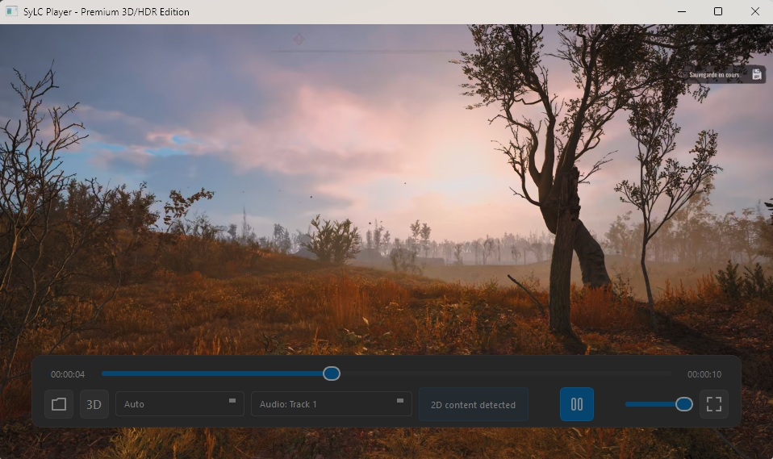

# SyLC 3D Player - Premium Edition

A high-performance video player for Windows, specially designed for 3D and HDR enthusiasts. It is optimized for **Nvidia 3D Vision** and home theater projectors (e.g., Sony VPL-HW55ES).



## Main Features

- **Advanced 3D Support**: Automatic detection of 3D formats (`MVC`, `Side-by-Side`, `Top-Bottom`) and optimized configuration for **Frame Packing** (1920x2205@24fps), ideal for compatible projectors.
- **Nvidia 3D Vision Optimization**: Designed to integrate perfectly with Nvidia's 3D Vision ecosystem using the D3D11 API for a hardware-accelerated stereoscopic 3D experience.
- **Superior Image Quality**: Uses MPV's `gpu-next` rendering engine for high-quality HDR playback and scaling, ensuring maximum image fidelity.
- **Premium Interface**: Modern and responsive controls, a timeline with image preview on hover, and a neat aesthetic for a pleasant user experience.
- **Automatic Analysis**: Uses `ffprobe` to analyze video files in depth and apply the best 3D settings automatically.

## Prerequisites

- **Python 3.8+**
- **FFmpeg and FFprobe**: **CRUCIAL**. The application needs `ffmpeg.exe` and `ffprobe.exe` to function.
- **mpv**: The `mpv-2.dll` is required for video playback.

You can use the `setup.py` script to automatically download and install the required third-party files.

## Installation

1.  **Clone the repository:**
    ```sh
    git clone https://github.com/5ymph0en1x/SyLC.git
    cd SyLC
    ```

2.  **Create and activate a virtual environment:**
    ```sh
    python -m venv .venv
    .\.venv\Scripts\activate
    ```

3.  **Install the dependencies:**
    ```sh
    pip install -r requirements.txt
    ```

4.  **Download and install third-party dependencies:**
    ```sh
    python setup.py
    ```

## Launching

Once the installation is complete, launch the application with:
```sh
python SyLC.py
```

## Compiling to .exe

The project includes a configured `SyLC_Player.spec` file. To compile the single executable:
```sh
pyinstaller SyLC_Player.spec
```

## Technologies Used

- **Python**
- **PySide6** for the graphical interface
- **python-mpv** for the integration of the MPV player
